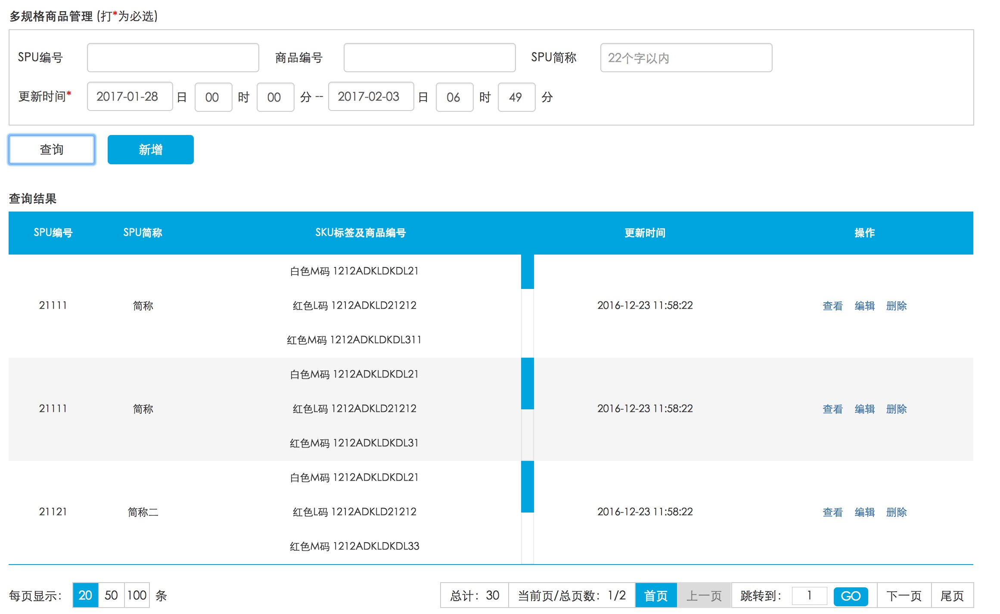

# bigMom
基于angular框架和extJS的配置化思想，自己研发了一套新的配置化、组件化、适用于快速开发后台管理系统的一套框架。

## 核心思想：

在定制化需求不高的后台系统里，前端应该更加关注功能的实现、编码的效率和代码的可维护性。

因而，该框架在传统的基础组件和业务代码之间又独立了一层业务型组件的概念。增加该层的主要原因是，后台系统中，由于业务形态、页面样式、界面功能等都是高度可重用的。在本人看来，大部分是由查询组件、结果组件（大部分为table形式）和操作组件这三部分构成）。
故提出了配置化编程的概念（extJs的核心思想），即对界面进行组件配置就可以自动生成相关界面。具体示例如下：

```
    // 查询条件配置
    $scope.condition = {
        name: '多规格商品管理',
        nameSuffix: {
            type: 'dynamic',
            template: '<span>(打<span style="color: red">*</span>为必选)</span>'
        },
        conditions: {
            spuID: {
                title: 'SPU编号',
                style: 'inline',
                type: 'input',
                inputStyle: 'long-input'
            },
            productID: {
                title: '商品编号',
                style: 'inline',
                type: 'input',
                inputStyle: 'long-input'
            },
            shortName: {
                title: 'SPU简称',
                style: 'inline',
                placeholder: '22个字以内',
                type: 'input',
                inputStyle: 'long-input'
            },
            updateTime: {
                title: '更新时间',
                style: 'block',
                type: 'timeRangeMinuteView',
                isRequired: 'true',
                startDate: DateTool.startDay(+new Date() - 6 * 24 * 3600 * 1000),
                endDate: +new Date()
            }
        },

        buttons: [{
            buttonText: '查询',
            style: 'inline',
            type: 'button',
            callback: function () {
                $scope.search(1);
                // 重新查询后 分页回到第一页
                $scope.table.pagination.currentPage = 1;
                $scope.table.pagination.inputPage = 1;
            }
        }, {
            buttonText: '新增',
            style: 'inline',
            type: 'button',
            class: 'btn-primary',
            callback: function () {
                var pageId = 'act-spu-add';
                var url = 'xmall/act-spu-detail.html?'
                            + '&operation=' + 'add';

                window.parent.tabCont('商品SPU新增', pageId, url);
            }
        }]
    };

    // 查询内容配置
    $scope.table = {
        data: {
            emptyWords: '请输入查询条件并点击查询按钮',
            header: ['SPU编号', 'SPU简称', 'SKU标签及商品编号', '更新时间', '操作'],
            body: []
        },
        pagination: {
            events: {
                goPage: function (page, pageNum) {
                    $scope.search(page, pageNum, $scope.pageCondition);
                }
            }
        }
    };
```
    

